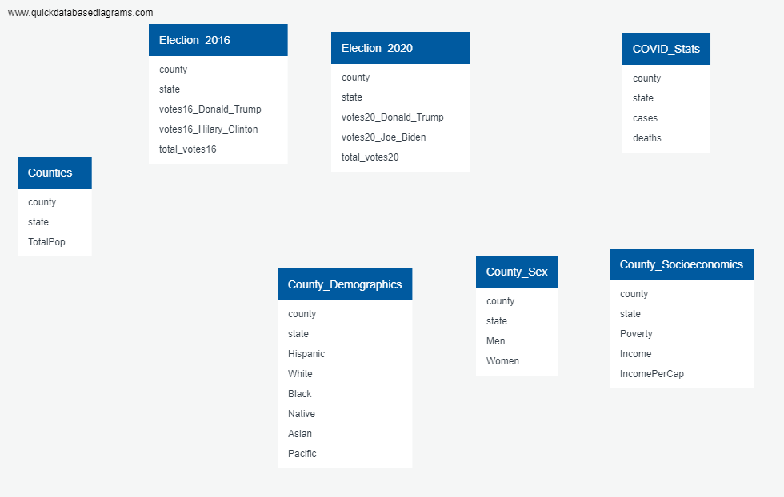

# Final_Project
## Overview
**Selected topic**

[Link to Presentation](https://docs.google.com/presentation/d/1xdDUYNJqjwQh7HjSNzms4qzsJXtMZ27hIY0XhTGuiYQ/edit#slide=id.p)

Our selected topic was Election results, COVID, and Demographic Data by Counties.

* Reason the topic was selected
* Current Event 
* The dataset we selected was fairly easy to navigate
* There were many topics to conduct our analysis 
* Our dataset was fairly large.

**Description of the source of data**

Our data is in a CSV file from from kaggle
[Data Link](https://www.kaggle.com/etsc9287/2020-general-election-polls?select=county_statistics.csv)

**Questions the team hopes to answer with the data**

* Is there a correlation between COVID cases and voter turnout?
* Is there a relationship between income and voter affiliation?
* How much changed between the 2016 election and the 2020 election?

**Description of the data exploration phase of the project**

When exploring our dataset we had a fairly large amount of columns and rows. Based off the data we selected certain columns to further research. We have broken these columns into the following categories:

    1. Counties
    2. Election 2016 Results
    3. Election 2020 Results
    4. COVID
    5. County Wealth Distributions 
    6. County Demographics 
    7. County Gender Distribution  

**Description of the analysis phase of the project**

**Technologies, languages, tools, and algorithms used**

    - Considered technologies: SQLite, Jupyter Notebook, Flask App, SQLAlchemy
    - Technologies used:
      - PostGres & SQLite
      - Jupyter Notebook 
      - QuickDBD

**Result of analysis**

**Recommendation for future analysis**

**Anything the team would have done differently**

## Machine Learning Model

For now, we will be conducting a linear regression model for our data. We want to build a model that will predict how different demographics and factors have affected the way people voted in the 2020 election. We also want to see if these demographics and factors have any correlation with the number of covid cases in those areas and if that, in turn, had any correlation with the way that people voted in that area. 

## ROLES
* Square- Muhammad
* Triangle- Andreea
* Circle- Mylissa
* X- Phil
