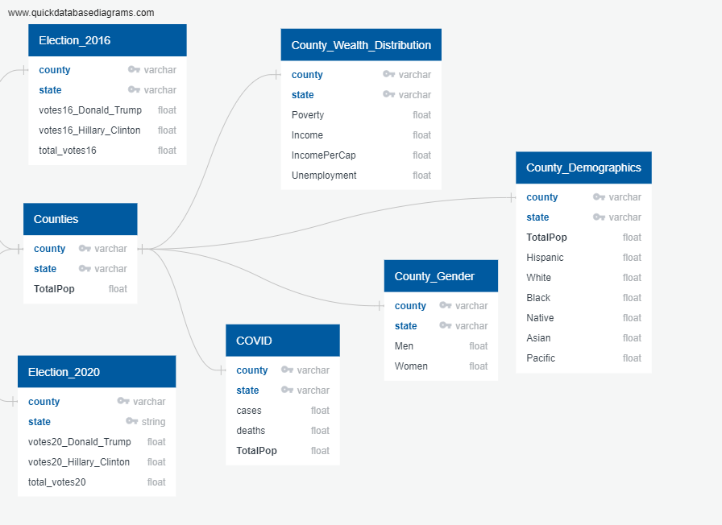

# Final_Project

## Overview

[Link to Presentation Slides](https://docs.google.com/presentation/d/1xdDUYNJqjwQh7HjSNzms4qzsJXtMZ27hIY0XhTGuiYQ/edit#slide=id.p)

### Files

### **Selected topic**

Our selected topic was Election results, COVID, and Demographic Data by Counties.

Reasons the topic was selected:
* Current Event 
* The dataset we selected was fairly easy to navigate
* There were many topics to conduct our analysis 
* Our dataset was fairly large with enough columns and values to complete an analysis.

### **Description of the source of data**

Our data is in a CSV file from from kaggle
[Data Link](https://www.kaggle.com/etsc9287/2020-general-election-polls?select=county_statistics.csv)

### **Questions the team hopes to answer with the data**

* Is there a correlation between COVID cases and voter turnout?
* Is there a relationship between income and voter affiliation?
* How much changed between the 2016 election and the 2020 election?

## Data exploration phase

When exploring our dataset we had a fairly large amount of columns and rows. Based off the data we selected certain columns to further research. We have broken these columns into the following categories:

    1. Counties
    2. Election 2016 Results
    3. Election 2020 Results
    4. COVID
    5. County Wealth Distributions 
    6. County Demographics 
    7. County Gender Distribution  

## Analysis phase of the project

### Tableau

- [Link to 2016-2017 Election Analysis Storyboard on Tableau Pubic](https://public.tableau.com/profile/carolina4264#!/vizhome/2016-2020ElectionAnalysis/2016and2020ElectionResultsAnalysis)

### **Technologies, languages, tools, and algorithms used**

    - Considered technologies: SQLite, Jupyter Notebook, Flask App, SQLAlchemy
    - Technologies used:
      - PostGres & SQLite
      - Jupyter Notebook & Python 
      - QuickDBD
      - Tableau
      - Amazon Web Services 

## Machine Learning Model
After cleaning our dataset we will be conducting an logistic regression model for our data. We want to build a model that will predict how different demographics and factors have affected the way people voted in the 2020 election. We also want to see if these demographics and factors have any correlation with the number of covid cases in those areas and if that, in turn, had any correlation with the way that people voted in that area. 

Why Logistic Regression? 
* This is the best fit Machine Learning Model for our data
* Supervised Machine Learning→ classification
* Answers the question of “who did people vote for in both elections?”
* Explains the relationship between one dependant binary variable and multiple independent variables
* Target → who won each state
* Features → Votes per candidate, Covid data, Demographics data, wealth data

## Result of analysis
### 2016 Election Analysis
After we ran our logistic regression model we were presented with our results. Based off the results for the 2016 confusion matrix we can see that our model accurately predicts our results. We can see that becuase of our accuracy score of .998. That alone wasn't enough for us to use so we decided to create a confusion matrix. After further analysis we can see that our confusion matrix is reinforcing our accuracy score. Our precision (PPV), recall, and F1 scores are near perfect. This tells us that our model is accurately predicting our results.

### 2020 Election Analysis
Since we recieved near perfect results for our 2016 election, I had predicted that the 2020 results would be relatively similar. Our accuracy score was .997 which is almost the same as the 2016 anaylsis. The same goes for our confusion matrix as well. The results are nearly identical to the 2016 election which tells us that our logistic regression model is working. 

### Clustering
After completing our Logistic regression model and recieving great results for it, I wanted to cluster our data points to better analyze the data. By clustering our data we can see with more clarity the types of relationships each variable has. To start I wanted to compare the types of income with poverty to see how they would vote for a certain candidate. After clustering income, poverty, and the votes per candidate we can see which class voted for which candidate. It turns out more upper class and upper middle class counties voted for Trump. Whereas more lower middle class and poverty filled counties voted for Biden.

## Machine Learning 2

A basic Linear Regression was applied to the cleaned_county_data.csv to show an analysis to answer our questions if there was a relationship between income and voter affiliation and how much changed between the 2016 and 2020 results. The goal of the linear regression model is to predict a county's percentage of voting either democrat or republican based on income. 

## Machine Learning 2 Results

Our plots in the image represent the republican vote in red and the democrat vote in dark blue from both the 2016 election on top and the 2020 election results on the bottom. From the plots, we are able to make accurate predictions with the best fit line that future elections will continue in the trend shown above. There seemed to be slight change from the democrat linear regression and visualizes a slight increase in percentage of votes based on a higher income. Republican votes seemed to stay similar in the two different elections. The counties with higher incomes proved to vote more democrat than republican.

**Recommendation for future analysis**
There are various things we could do additionally to make the predictions and analysis more accurate: 
* Analyze data from the 2012 election to determine trends
* Demographic and economic data should be included for all election years involved in order to predict accurate demographic and economic trends
* Beginning with the Tableau dashboard (we left it towards the end) helped visualize our data and assess trends very easily and would have helped us in building our machine learning model more efficiently

**Anything the team would have done differently**

* The dataset had information for the 2016 and 2020 election, however, the latest public demographic and economic data is from 2017, so this dataset can't be used to find demographic and economic shifts in counties and states between 2016 and 2020
* Finding a solution to duplicate county names in different states and making sure that we had unique values of “County, State” 
** This was more challenging in terms of the machine learning model. In Tableau, I was able to make a new measure and filter for “County, State” 
* Planning the project structure and having clear roles and duties for our team members

